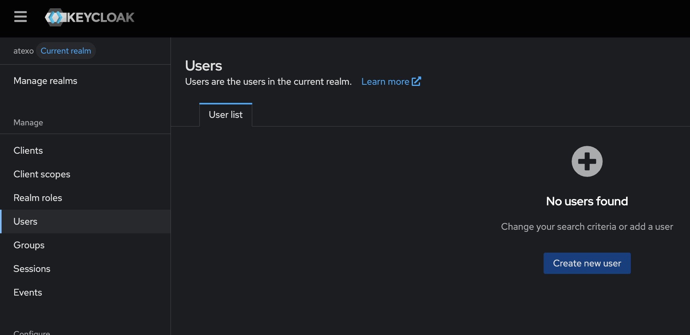
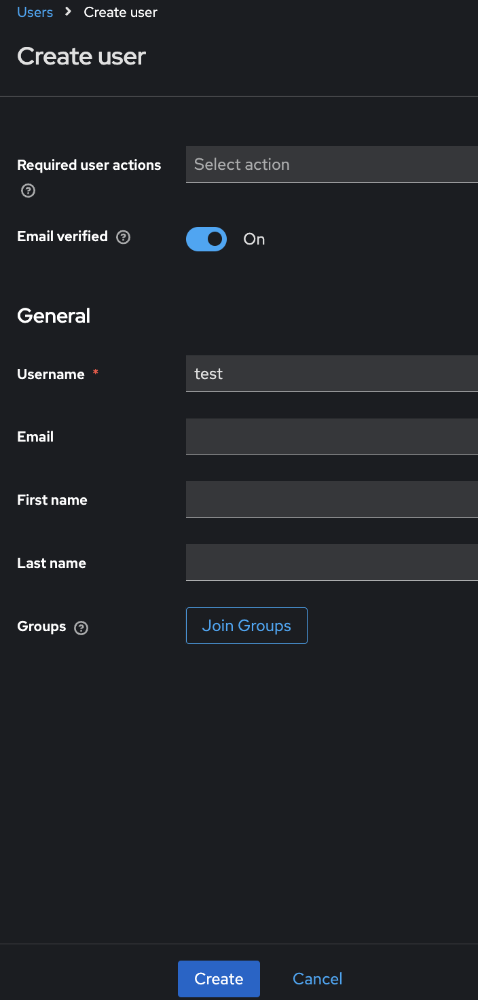
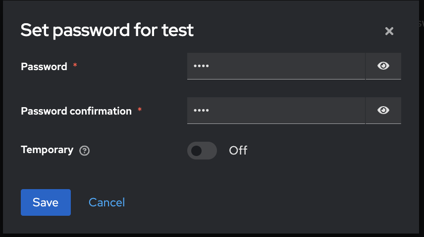

# Atexo Backend - Docker Compose Principal

Ce docker compose principal orchestre tous les services de l'application Atexo en un seul déploiement.

## Services inclus

  - **Flask Backend** (port 5000) - API principale de l'application
  - **Keycloak** (ports 7080, 7443) - Service d'authentification et d'autorisation. Le déploiement de ce service est désactivable en utilisant le Mode 1. 
  - **HAProxy** (ports 3000, 8000, 8001, 8002, 8404) - Reverse proxy (authentification sur les services de Wrenai)
  - **WrenAI Services** - Suite complète de services d'IA :
    - Wren Bootstrap
    - Wren Engine (port 8001)
    - Wren AI Service (port 8000)
    - Wren UI (port 3000)
    - Ibis Server (port 8002)
    - Qdrant (base de données vectorielle)
  - ** Bootstrap Config ** - Service permettant la connexion entre l'API et la base de donnée à intérroger via le chatbot.

## Prérequis

  - Docker et Docker Compose installés
  - Au moins 8GB de RAM disponible
  - 10GB d'espace disque libre

## Configuration

  1. Copiez le fichier d'environnement :
    ```bash
    cp env.example .env
    ```

  2. Modifiez le fichier `.env` selon vos besoins
  ```
  KEYCLOAK_REALM=atexo
  KEYCLOAK_CLIENT_ID=atexo-wrenai
  KEYCLOAK_CLIENT_SECRET=Secret du client KEYCLOAK_CLIENT_ID
  KEYCLOAK_SERVER_URL=Url du serveur keycloak à utiliser
  MISTRAL_API_KEY=Mistral Api key
  MISTRAL_PREPROMPT=Préprompt personnalisable pour indiquer un comportement à respecter par le chatbot.
  DB_HOST=Hôte de la DB que le chatbot va intérroger (si sur le même network docker, utiliser host.docker.internal au lieu de localhost)
  DB_PORT=Port de la DB que le chatbot va intérroger
  DB_USER=Nom d'utilisateur de la DB que le chatbot va intérroger
  DB_PASSWORD=Mot de passe de la DB que le chatbot va intérroger
  DB_NAME=Nom de la DB que le chatbot va intérroger
  DB_SSL=false/true
  ```
## Déploiement

### Modes de déploiement

#### Mode 1 : Sans déploiement d'un Keycloak local (renseigner les infos d'un keycloak déployé dans le fichier .env est tout de même requis)

  ```bash
  # Utilise uniquement docker-compose.yml
  docker compose -f docker-compose.yml up -d
  docker cp db.sqlite3 atexo_wren_bootstrap:/app/data/db.sqlite3
  ```
  L'interface web du chatbot est accessible sur http://localhost:4200/.


#### Mode 2 : Avec Keycloak déployé en local (environnemnt de développement)
  L'application utilise une architecture flexible permettant de déployer Keycloak de manière conditionnelle.
  - **`docker-compose.yml`** : Configuration de base sans Keycloak
    - Flask Backend avec authentification activée (utilise une instance Keycloak externe, bien penser à mettre à jour les variables du `.env`)
    - HAProxy avec authentification activée
    - Tous les services WrenAI

  - **`docker-compose.override.yml`** : Ajoute Keycloak local et ses dépendances
    - Service Keycloak complet, les variables d'environnement dans `env.example` sont déjà configurées pour le keycloak local, seule la variable de Mistral est à modifier.
    - Dépendances Flask et HAProxy vers Keycloak local


  ```bash
  # Utilise docker-compose.yml + docker-compose.override.yml
  docker compose -f docker-compose.yml -f docker-compose.override.yml up -d
  docker cp db.sqlite3 atexo_wren_bootstrap:/app/data/db.sqlite3 && docker compose restart wren-engine ibis-server wren-ai-service wren-ui qdrant
  docker compose up bootstrap-config -d
  docker exec -it atexo_keycloak bash -c "cd /opt/keycloak/bin && ./kcadm.sh config credentials --server http://localhost:7080 --realm master --user admin && ./kcadm.sh update realms/master -s sslRequired=NONE" # Entrer le mot de passe `admin` lorsque demandé
  ```

##### Configuration Keycloak (lorsque le Mode 2 est utilisé)

  > **Note :** Ces étapes simplifient l'accès à la version locale du chatbot. En production, utilisez le Mode 1.

###### 1. Accès à l'interface Keycloak
  - Ouvrir http://localhost:7080/ dans votre navigateur
  - S'authentifier avec : `admin` / `admin`
  - Sélectionner le realm : `atexo`

###### 4. Création d'un utilisateur
  - Cliquer sur **Users** → **Create new user** 
  - Renseigner le nom d'utilisateur souhaité 
  - Cliquer sur **Credentials** → **Set password** 
  - Définir le mot de passe souhaité
  - Sauvegarder

L'interface web du chatbot est accessible sur http://localhost:4200/, vous pouvez vous y connecter avec un utilisateur précédement créé.