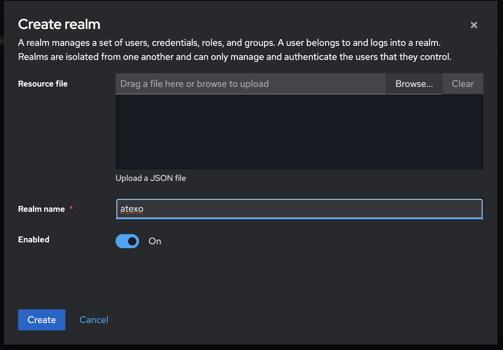
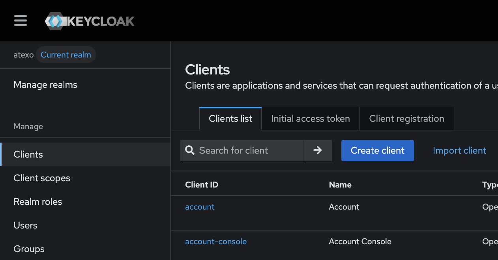
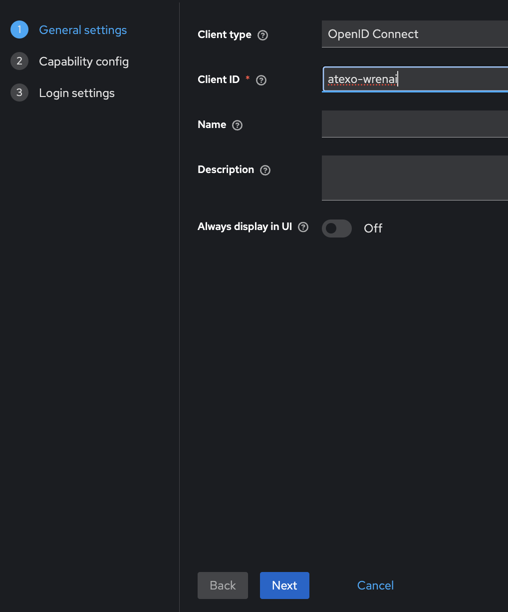
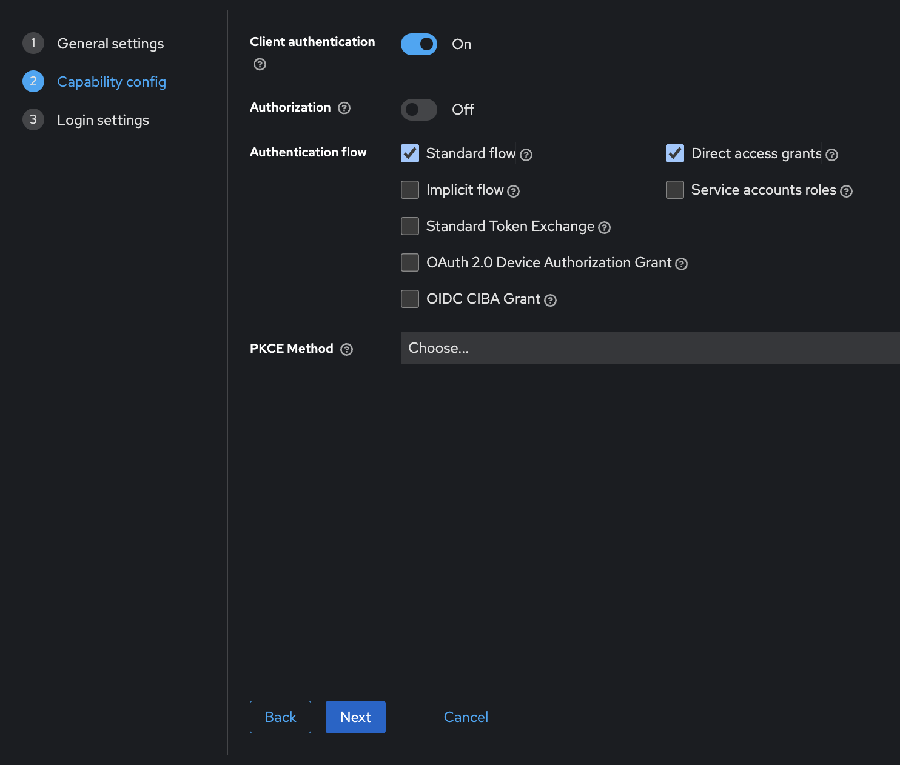
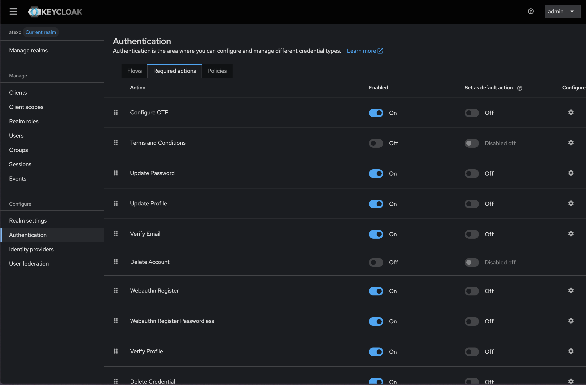
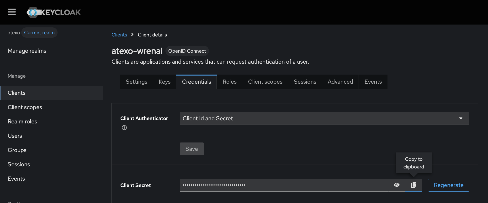

# Atexo Backend - Docker Compose Principal

Ce docker-compose principal orchestre tous les services de l'application Atexo en un seul déploiement.

## Services inclus

- **Flask Backend** (port 5000) - API principale de l'application
- **Keycloak** (ports 7080, 7443) - Service d'authentification et d'autorisation. Le déploiement de ce service est désactivable pour d'utiliser une instance de Keycloak déjà déployée (`LOCAL_AUTH_ENABLED=false` dans le ficher `.env`)
- **HAProxy** (ports 3000, 8000, 8001, 8002, 8404) - Reverse proxy (authentification sur les services de Wrenai)
- **WrenAI Services** - Suite complète de services d'IA :
  - Wren Bootstrap
  - Wren Engine (port 8001)
  - Wren AI Service (port 8000)
  - Wren UI (port 3000)
  - Ibis Server (port 8002)
  - Qdrant (base de données vectorielle)

## Prérequis

- Docker et Docker Compose installés
- Au moins 8GB de RAM disponible
- 10GB d'espace disque libre

## Configuration

1. Copiez le fichier d'environnement :
  ```bash
  cp env.example .env
  ```

2. Modifiez le fichier `.env` selon vos besoins
```
KEYCLOAK_REALM=atexo
KEYCLOAK_CLIENT_ID=atexo-wrenai
KEYCLOAK_CLIENT_SECRET=Secret du client KEYCLOAK_CLIENT_ID
KEYCLOAK_SERVER_URL=Url du serveur keycloak à utiliser
MISTRAL_API_KEY=Mistral Api key
LOCAL_AUTH_ENABLED=Si docker doit déployer un keycloak (environnement de développement)
```
## Déploiement

### Démarrage rapide

```bash
docker compose up -d
docker cp db.sqlite3 atexo_wren_bootstrap:/app/data/db.sqlite3
```

L'interface web du chatbot est accessible sur http://localhost:4200/.

### Configuration Keycloak (environnement de développement avec LOCAL_AUTH_ENABLED=true)

> **Note :** Ces étapes simplifient l'accès à la version locale du chatbot. En production, configurez les variables d'environnement Keycloak et définissez `LOCAL_AUTH_ENABLED=false`.

#### 1. Accès à l'interface Keycloak
- Ouvrir http://localhost:7080/ dans votre navigateur
- S'authentifier avec : `admin` / `admin`

#### 2. Création du realm
- Cliquer sur **Manage realms** → **Create realm** 
- Nommer le realm : `atexo` 

#### 3. Configuration du client
- Cliquer sur **Clients** → **Create client** 
- Nommer le client : `atexo-wrenai` 
- Cocher les options suivantes :
  - ✅ Client authentification
  - ✅ Standard flow  
  - ✅ Direct access grants 
- Dans **Valid redirect URIs** : `http://localhost/*`
- Dans **Web origins** : `http://localhost`
- Sauvegarder

#### 4. Création d'un utilisateur
- Cliquer sur **Users** → **Create new user** 
- Renseigner le nom d'utilisateur souhaité 
- Cliquer sur **Credentials** → **Set password** 
- Définir le mot de passe souhaité
- Sauvegarder

#### 5. Configuration de l'authentification
- Cliquer sur **Authentication** 
- Décocher toutes les cases bleues **Enabled** 

#### 6. Récupération du secret client
- Cliquer sur **Clients** → **atexo-wrenai** → **Credentials**
- Copier le **Client Secret** 
- Coller dans le fichier `.env` : `KEYCLOAK_CLIENT_SECRET=votre_secret`

#### 7. Redémarrage des services
```bash
docker compose build flask-app haproxy
docker compose up -d
```